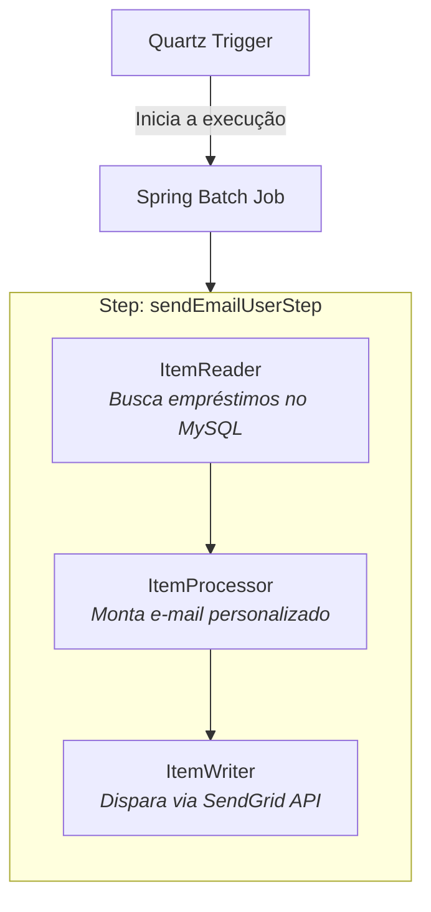

# Send Book Loan Email Notification System (Spring Batch + Quartz)

[](https://www.oracle.com/java/)
[](https://spring.io/projects/spring-boot)
[](https://spring.io/projects/spring-batch)
[](https://www.quartz-scheduler.org/)
[](https://www.mysql.com/)
[](https://sendgrid.com/)
[](https://www.docker.com/)

Aplicação Java Spring Boot projetada para automatizar o envio de notificações de devolução de livros de uma biblioteca municipal. A rotina utiliza **Quartz Scheduler** para disparo periódico, **Spring Batch** para processamento performático baseada em *Chunk* e a **SendGrid API** para entrega dos e-mails aos usuários.

---



---

## 📌 Arquitetura do Processamento Batch

O job `sendBookLoanNotificationJob` é orquestrado via Quartz e executa as seguintes etapas:

1. **ItemReader (`JdbcCursorItemReader`):** Consulta a base relacional MySQL buscando empréstimos cuja data limite de devolução vence no dia seguinte (6 dias após o empréstimo).
2. **ItemProcessor (`ItemProcessor`):** Mapeia a entidade `UserBookLoan` e monta o template textual personalizado contendo os dados do usuário, livro e data exata de devolução.
3. **ItemWriter (`ItemWriter`):** Dispara a requisição para a API externa do **SendGrid** via protocolo HTTP POST (`/v3/mail/send`).

---

## 🛠️ Tecnologias Utilizadas

* **Java 21**
* **Spring Boot 3.5.16** (Spring Batch, Spring Quartz, Spring JDBC)
* **MySQL 8.0** (Banco de dados relacional)
* **phpMyAdmin** (Gerenciamento web do banco local)
* **SendGrid Java SDK** (Integração para e-mails transacionais)
* **Docker & Docker Compose** (Virtualização do ambiente de desenvolvimento)

---

## ⚙️ Configuração do Ambiente

### Pré-requisitos
* **JDK 21** instalado e configurado nas variáveis de ambiente.
* **Maven 3.8+**
* **Docker** e **Docker Compose** ativos.
* Chave de API da plataforma **SendGrid**.

---

## 🚀 Como Executar o Projeto

### 1. Clonar o repositório

```bash
git clone [https://github.com/seu-usuario/send-book-email-sb.git](https://github.com/seu-usuario/send-book-email-sb.git)
cd send-book-email-sb
```
### 2. Subir a infraestrutura com Docker
Execute o comando abaixo para iniciar os containers do MySQL e phpMyAdmin:

```bash
docker-compose up -d
```

* **MySQL:** `localhost:3307`
* **phpMyAdmin:** `http://localhost:5050`

### 3. Carga Inicial do Banco de Dados
Conecte-se ao banco `mydatabase` (usuário: `user`, senha: `1234567`)[cite: 2] e execute os comandos DDL e DML localizados no arquivo:

```path
files/script.sql
```
### 4. Configurar a Chave do SendGrid
No arquivo `src/main/resources/application.properties` (ou variável de ambiente), informe a sua API Key do SendGrid:

```properties
spring.sendgrid.api-key=SUA_SENDGRID_API_KEY
```

### 5. Executar a Aplicação
Execute via Maven ou STS/Eclipse:

```bash
mvn spring-boot:run
```

## 🕒 Configuração do Agendamento (Quartz)
A frequência de disparo é configurada no bean `QuartzConfig`:

```java
@Bean
Trigger jobTrigger(JobDetail sendBookLoanNotificationJobDetail) { 
    // Exemplo: Executa diariamente às 10:55
    String exp = "0 55 10 * * ?";				
            
    return TriggerBuilder
            .newTrigger()
            .forJob(sendBookLoanNotificationJobDetail)
            .startNow()
            .withSchedule(CronScheduleBuilder.cronSchedule(exp))
            .build();
}
```

## ✉️ Exemplo do E-mail Enviado

> **De:** Biblioteca Municipal (`edson.ney@gmail.com`)
> **Para:** `usuario@dominio.com`  
> **Assunto:** Notificação devolução livro
>
> Prezado(a), Maria, matricula 1
> Informamos que o prazo de devolução do livro Alguma poesia é amanhã (18/09/2026)
> Solicitamos que você renove o livro ou devolva, assim que possível.
> A Biblioteca Municipal está funcionando de segunda a sexta, das 9h às 17h.
> 
> Atenciosamente,
> Setor de empréstimo e devolução
> BIBLIOTECA MUNICIPAL
